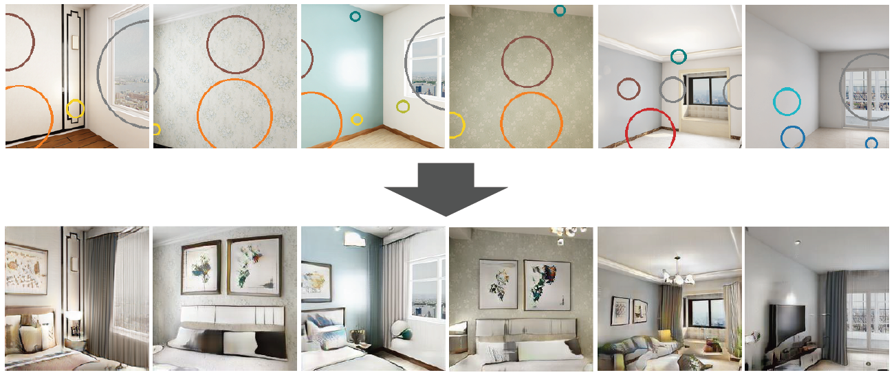

# Neural Scene Decoration

This is the code repository for the ECCV 2022 submission "Neural Scene Decoration from a Single Photograph".



### Instructions

1. Download the [Structured3D](https://structured3d-dataset.org/) dataset and organize it in the following format:

```
Structured3D
	- data
		- scene_00000
		- scene_00001
		- ...
		- scene_03499
	- splits
		- bedroom_obj
		- living_room_obj
```

where `splits` are provided in this repository, and the scenes in `data` are downloaded from Structured3D.

2. Create virtual environment and install the dependencies. By default, the CUDA version used is 11.3.

```
conda create --name nsd python=3.8
pip install -r requirements.txt
```

3. Change dataset path (`--data`) in` train_struct3d.sh` to 

4. Run `train_struct3d.sh` to start training.

### Acknowledgement

This respository is modified from [https://github.com/lucidrains/lightweight-gan](https://github.com/lucidrains/lightweight-gan). 

### Citation

Please cite our paper if you find it useful for your research:

```
@inproceedings{pang2022nsd,
  title={Neural Scene Decoration from a Single Photograph},
  author={Hong-Wing Pang and Yingshu Chen and Phuoc-Hieu Le and Binh-Son Hua and Duc Thanh Nguyen and Sai-Kit Yeung},
  year={2022},
  booktitle={ECCV},
}
```
